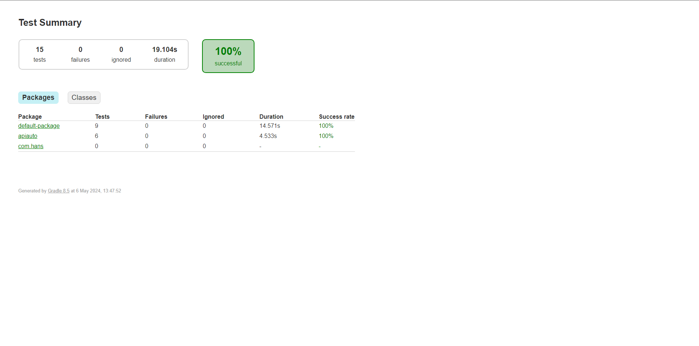

# JayJayGitHubActions

- Pengujian otomatisasi API dan UI Web menggunakan Cucumber, Java, Gradle, Selenium, dan JUnit
- Pengujian otomatisasi API dengan menjalankan perintah berikut: "./gradlew apiTest"
- Pengujian UI Web dengan menjalankan perintah berikut: "./gradlew cucumber"

