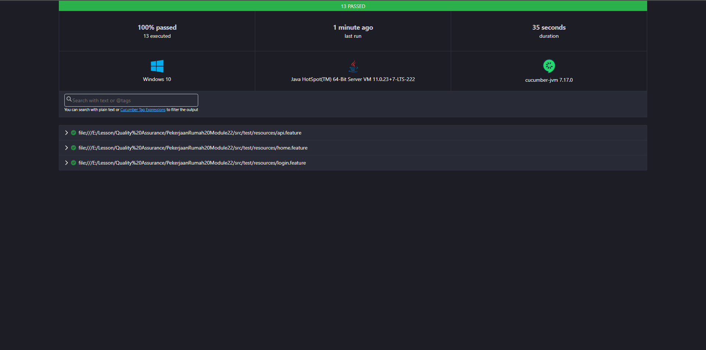

# JayJayGitHubActions

- Pengujian otomatisasi API dan UI Web menggunakan Cucumber, Java, Gradle, Selenium, dan JUnit, serta konfigurasi GitHub Actions
- Pengujian otomatisasi API dan UI Web dapat dijalankan dengan perintah berikut: "./gradlew cucumber"

